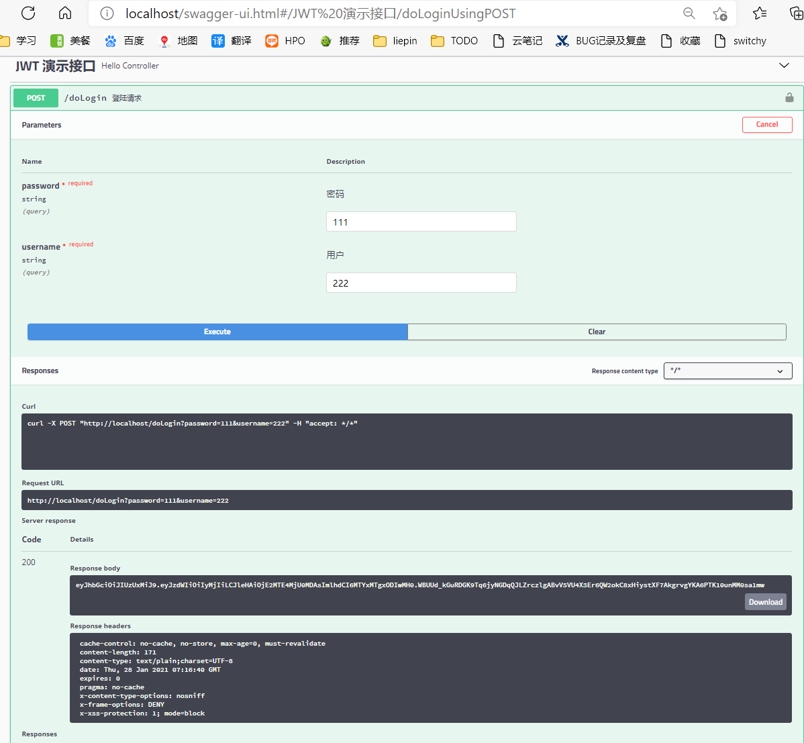
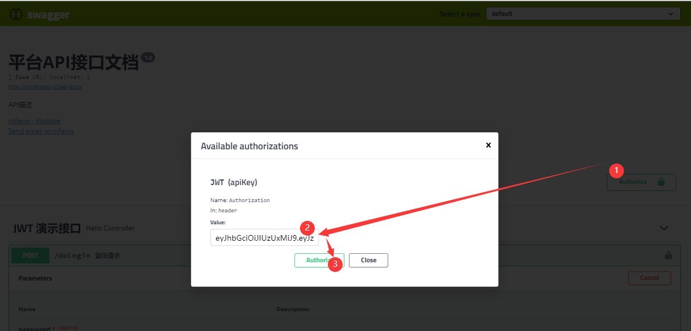
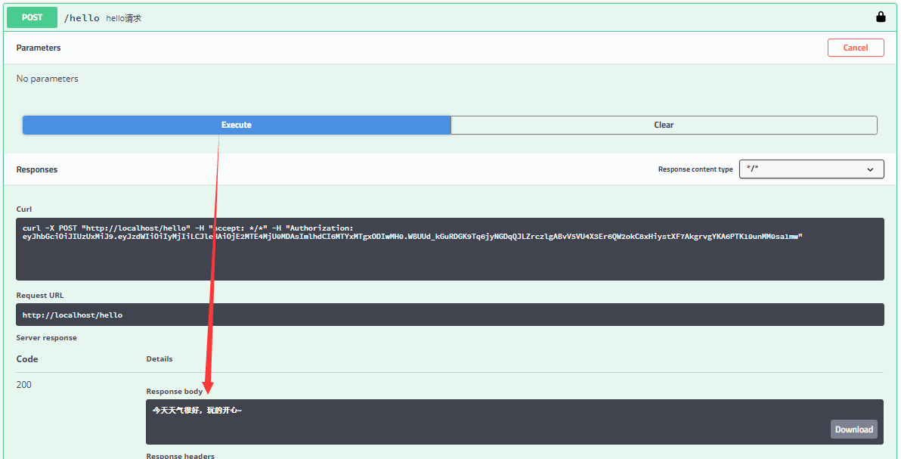

# helloworld springboot 集成 security 和 jwt

> 集成 security 和 jwt，没有使用数据库去校验用户是否合法，仅靠代码判断。

## 一、token 与 session 的区别

token与session的不同主要在

- ① 认证成功后，会对当前用户数据进行加密，生成一个加密字符串token，返还给客户端（服务器端并不进行保存）
- ② 浏览器会将接收到的token值存储在Local Storage中，（通过js代码写入Local Storage，通过js获取，并不会像cookie一样自动携带）
- ③
  再次访问时服务器端对token值的处理：服务器对浏览器传来的token值进行解密，解密完成后进行用户数据的查询，如果查询成功，则通过认证，实现状态保持，所以，即时有了多台服务器，服务器也只是做了token的解密和用户数据的查询，它不需要在服务端去保留用户的认证信息或者会话信息，这就意味着基于token认证机制的应用不需要去考虑用户在哪一台服务器登录了，这就为应用的扩展提供了便利，解决了session扩展性的弊端。

## 二、完成基础工作

## 三、添加 Swagger2 支持

> 已经设置启动项目后自动加载 swagger2，访问 http://localhost/swagger-ui.html  
> 注意：swagger2 相关 URL 已经设置不登录也可访问。但是 swagger2 内部发起的请求需要鉴权。

### 第一步、/doLogin 请求获取 token

### 第二步、将第一步中的 Response Body 内容复制，并粘贴到 Value 内

### 第三步、/hello 请求正常展示 Response Body

